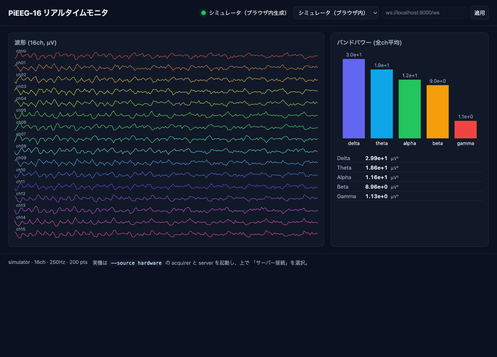

# PiEEG App — 脳波の取得・集計・Web表示

PiEEG-16 から 16ch の脳波を読み取り、サーバーでバンドパワーに集計して Web にリアルタイム表示する最小構成のアプリです。
[`eeg_roomba/pi_a_acquirer`](../../eeg_roomba) を参考に、**ルンバ制御・LSL・MQTT・TimescaleDB を外し**、
「取得 → 集計 → 表示」だけに絞って移植しています。



> 📐 アーキテクチャ図（子供向け / 情報系大学生向けの2段階）は [docs/architecture.md](docs/architecture.md) 参照。

## 構成

```
PiEEG-16 (SPI)                サーバー (FastAPI)              Web (Vite + TS + Canvas)
┌──────────────┐  WS /ingest  ┌─────────────────────┐  WS /ws  ┌────────────────────┐
│ acquirer/    │ ───────────▶ │ server/             │ ───────▶ │ web/               │
│  codec.py    │  100ms chunk │  スライディング窓 1s │  ~4Hz    │  波形 + バンド棒    │
│  spi_driver  │  {ts,samples}│  band_powers()      │  集計    │  δθαβγ 表示        │
│  simulator   │              │  δ/θ/α/β/γ を計算    │  フレーム│  ブラウザ内simも可 │
└──────────────┘              └─────────────────────┘          └────────────────────┘
```

- **acquirer/** — Raspberry Pi 上で動く取得プロセス。ハードウェア(`spi_driver.PiEEG16`)または
  シミュレータ(`SimulatedPiEEG16`、ハード不要)から 16ch を読み、WebSocket でサーバーへ送信。
- **server/** — FastAPI。`/ingest` で受信 → 1 秒窓で Welch 相当の PSD からバンドパワーを集計 →
  `/ws` に接続した Web クライアントへ ~4Hz で配信。参考プロジェクトの LSL+MQTT+DB を 1 プロセスに集約。
- **web/** — 軽量な Vite + TypeScript + Canvas。**サーバー無しでもブラウザ内シミュレータで動く**ため、
  GitHub Pages にそのまま置いてデモできる。実機接続時は「サーバー接続」を選び `ws://…/ws` を指定。

### 表示パネル(web)

参考元 `eeg_roomba/frontend` を踏襲しつつ、依存ライブラリ無し(全て素の Canvas)で実装:

- **波形** — 16ch を積み上げ表示(自動スケール)。
- **バンドパワー** — δ/θ/α/β/γ の全ch平均を対数棒グラフ + 数値。
- **メンタル状態** — 集中度 `Focus = β/(α+θ)`(Pope engagement)とリラックス度 `Relax = α/(α+β)` を
  ゲージ + 時系列で表示し、集中/リラックス/中立を判定。`src/mind.ts`。
- **頭部トポグラフィ** — 選択バンドのch別パワーを 10-20 電極配置(`src/montage.ts`)で
  逆距離加重補間したスカルプヒートマップ。`src/topography.ts`。
- **3D 電極マップ** — 回転する頭部ドーム上に電極を配置。ライブラリ非依存の手書き 3D
  (透視投影 + 深度ソート)で、大きさ・色が選択バンドのパワーを表す。`src/brain3d.ts`。

## セットアップと実行

### 1. シミュレータだけで試す(ハード不要・最速)

Web をローカルで開くだけ。ブラウザ内でEEGを生成して波形とバンドパワーが動きます。

```bash
cd web
npm install
npm run dev        # http://localhost:5173 を開く（「シミュレータ」モードが既定）
```

### 2. サーバー経由(シミュレータ acquirer → サーバー → Web)

```bash
# サーバー
cd server
uv venv && uv pip install -e ".[dev]"
uv run uvicorn main:app --host 0.0.0.0 --port 8000

# 別ターミナル: シミュレータ acquirer をサーバーへ接続
cd acquirer
uv venv && uv pip install -e .
uv run python stream.py --source sim --server ws://localhost:8000/ingest
```

Web を開き「サーバー接続」を選択 → `ws://localhost:8000/ws` → 適用。

### 3. 実機(Raspberry Pi + PiEEG-16)

取得方法は 2 通り。**既に参考元の `pieeg-acquirer.service`(LSL 配信)が動いている Pi** では、
SPI を奪わない **LSL ブリッジ(推奨)** が無難です。

#### 3a. LSL ブリッジ(推奨 — 既存サービスを止めない)

参考元 acquirer が publish している LSL ストリーム `PiEEG-16` を localhost で購読し、
本アプリのサーバーへ中継します。SPI には触れません。

```bash
# Pi 上。pylsl の liblsl.so は参考元 venv のものを流用（PYLSL_LIB で指定）
cd /home/pieeg/pieeg_app/server
../.venv/bin/python -m uvicorn main:app --host 0.0.0.0 --port 8000 &

cd /home/pieeg/pieeg_app/acquirer
export PYLSL_LIB=/home/pieeg/Documents/eeg_roomba/pi_a_acquirer/.venv/lib/python3.13/site-packages/pylsl/lib/liblsl.so
../.venv/bin/python stream.py --source lsl --server ws://localhost:8000/ingest &
```

常駐させるなら `deploy/pieeg-app-server.service` と `deploy/pieeg-app-bridge.service` を
`/etc/systemd/system/` に置いて `systemctl enable --now` する(下記「Pi 常駐」参照)。

#### 3b. 直接 SPI 読み出し(参考元 acquirer を使わない場合)

```bash
cd acquirer
uv pip install -e ".[hardware]"    # spidev / gpiod を追加インストール
# 既存の pieeg-acquirer.service が動いていると SPI 競合するので先に停止
sudo systemctl stop pieeg-acquirer.service
uv run python stream.py --source hardware --server ws://<サーバーIP>:8000/ingest
```

Web は Pages 版または任意ホストで開き、`ws://<サーバーIP>:8000/ws`(Tailscale なら
`ws://<tailscale-ip>:8000/ws`)に接続。URL 直リンクは `?mode=server&url=ws://<ip>:8000/ws`。

### Pi 常駐(systemd)

```bash
sudo cp deploy/pieeg-app-server.service deploy/pieeg-app-bridge.service /etc/systemd/system/
sudo systemctl daemon-reload
sudo systemctl enable --now pieeg-app-server pieeg-app-bridge
```

### GitHub Pages(HTTPS)から実機へ接続する — tailscale serve で WSS 終端

GitHub Pages は HTTPS なので、ブラウザの mixed-content ポリシーにより **HTTPS ページから
平文 `ws://` へは接続できません**。Pi のサーバーを `wss://`(TLS)で公開する必要があります。
Tailscale を使っているなら `tailscale serve` が最も手軽です(tailnet 内のみ公開、証明書も自動)。

```bash
# Pi 上。localhost:8000 を https/wss で tailnet に公開
sudo tailscale serve --bg 8000
# → https://<host>.<tailnet>.ts.net/  →  http://127.0.0.1:8000
#   例: https://pieeg.tail29b1d2.ts.net/ , wss://pieeg.tail29b1d2.ts.net/ws
```

これで、tailnet に参加しているブラウザから Pages 版に直リンクで実機接続できます:

```
https://<user>.github.io/<repo>/?mode=server&url=wss://<host>.<tailnet>.ts.net/ws
```

停止は `sudo tailscale serve --https=443 off`。tailnet 外にも公開したい場合は
`tailscale funnel` を検討(公開範囲に注意)。ローカルで web を動かす場合は
`http://localhost` なので `ws://` のままで OK。

## テスト

```bash
# Python（codec の μV 変換、シミュレータ、バンドパワー集計、Hub）
pytest acquirer/tests server/tests -q

# Web（FFT/バンドパワー、シミュレータ）
cd web && npm test

# 型チェック
cd web && npm run typecheck

# 手動E2Eスモーク（サーバー起動後）
python scripts/e2e_check.py
```

## GitHub Pages へのデプロイ

`web/` を静的サイトとしてビルドし Pages に公開します。バックエンドは Pages では動かないため、
公開版は既定でブラウザ内シミュレータが動作します(実機接続はURLで `?mode=server&url=ws://…/ws`)。

1. リポジトリの **Settings → Pages → Build and deployment → Source** を **GitHub Actions** に設定。
2. `main` に push すると `.github/workflows/deploy-pages.yml` が `web/` をビルドして公開。

`vite.config.ts` は `base: "./"`(相対パス)なので、`https://<user>.github.io/<repo>/` の
サブパス配下でもそのまま動きます。

## 参考元からの主な変更点

| 参考元 (eeg_roomba) | 本アプリ |
|---|---|
| LSL outlet + MQTT health | 単一の WebSocket `/ingest` に集約 |
| ingest / feature / decision / api の4サービス | `server/` 1プロセス(集計のみ、decision削除) |
| TimescaleDB 永続化 | 永続化なし(スライディング窓のみ) |
| Pi-B + Arduino + Roomba 制御 | **削除**(表示に専念) |
| React + Three.js + uPlot | 軽量 Vite + TS + Canvas、ブラウザ内sim内蔵 |
| scipy.signal.welch | numpy のみの periodogram(依存軽量化) |

`acquirer/codec.py` と `acquirer/spi_driver.py` は参考元からそのまま移植(μV変換ロジックは不変)。
