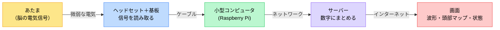
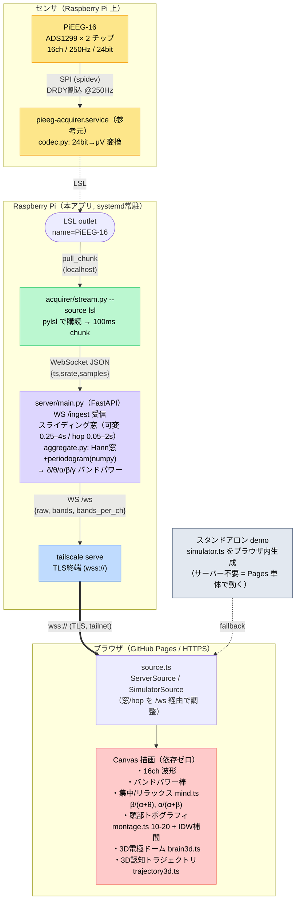
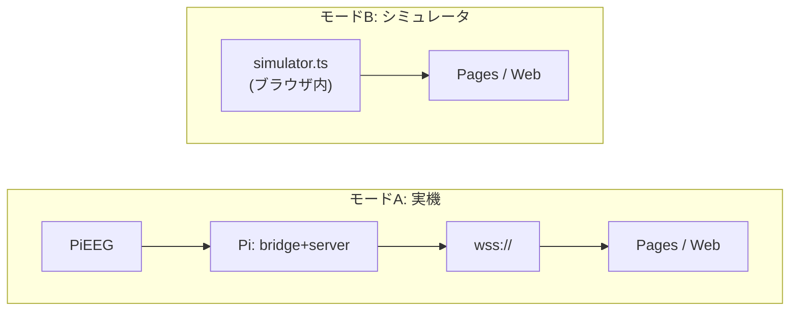

# アーキテクチャ

「脳波 → サーバー集計 → Web表示」をどう実現しているかを、2つの粒度で図解します。

- [概要（おおまかな流れ）](#概要おおまかな流れ)
- [詳細アーキテクチャ](#詳細アーキテクチャ)

---

## 概要（おおまかな流れ）

> 頭の微弱な電気を、小さなコンピュータが数字に変え、サーバーがまとめ、画面に描く。

**3ステップ**

1. **読み取る** … ヘッドセットの電極が脳の微弱な電気をひろう
2. **まとめる** … サーバーが「集中している／リラックスしている」などを計算
3. **描く** … 波形や、頭のどこが活発かを色で見せる

---

## 詳細アーキテクチャ

センサ → 取得 → 集計 → 配信 → 可視化 の各段と、実際に使うプロトコル/ライブラリを示します。
既存の参考プロジェクト（`eeg_roomba`）の LSL 配信を **SPI 非占有**でタップするのがポイント。

### データフローの要点

| 段 | 実装 | プロトコル / 手法 | 補足 |
|---|---|---|---|
| センサ | ADS1299 ×2 | SPI, DRDY割込 | ±4.5V / gain6 → μV。`codec.py` |
| 取得 | `pieeg-acquirer`（参考元） | LSL outlet | EEG/BCI 業界標準。時刻同期付き |
| 中継 | `stream.py --source lsl` | pylsl → WebSocket | **SPIを奪わない**。参考元と共存 |
| 集計 | `server/main.py` + `aggregate.py` | FastAPI WS, numpy | 窓/hop 可変（UIから調整） |
| 配信 | `tailscale serve` | wss:// (TLS) | HTTPS の Pages から接続可に |
| 可視化 | `web/`（Vite+TS+Canvas） | Canvas 2D / 自作3D | ライブラリ非依存で軽量 |

### 2つの動作モード

- **モードA** … 実際の脳波。Pi 上で bridge+server が常駐、`wss://` 経由で表示。
- **モードB** … ハード不要。ブラウザ内で合成EEGを生成するので **GitHub Pages 単体でデモ可能**。
  同じ計算（FFT/バンドパワー）を `fft.ts` がクライアント側で実行。

### 参考元 `eeg_roomba` からの主な簡略化

- ルンバ制御（decision / Pi-B / Arduino）を **削除**
- 4サービス（ingest/feature/decision/api）+ MQTT + TimescaleDB を **server 1プロセス**に集約
- React + Three.js + uPlot → **素の Canvas**（依存ゼロ, ビルド後 JS 約18KB）
- scipy.signal.welch → **numpy のみ**の periodogram
